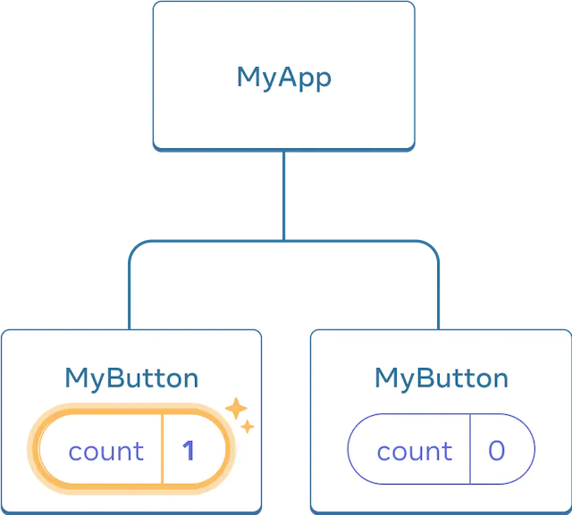
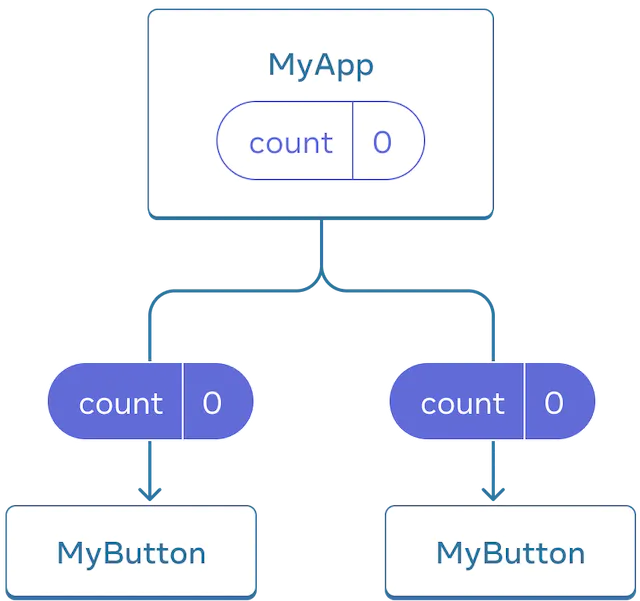

# Быстрый старт

[:octicons-tag-24: React v18](https://react.dev/learn)

Добро пожаловать в документацию по React! На этой странице вы познакомитесь с 80% концепций React, которые вы будете использовать ежедневно.

- Как создавать и размещать компоненты
- Как добавлять разметку и стили
- Как отображать данные
- Как отображать условия и списки
- Как реагировать на события и обновлять экран
- Как обмениваться данными между компонентами

## Создание и вложение компонентов

Приложения React состоят из _компонентов_. Компонент - это часть пользовательского интерфейса, которая имеет свою собственную логику и внешний вид. Компонент может быть маленьким, как кнопка, или большим, как целая страница.

Компоненты React - это функции JavaScript, которые возвращают разметку:

<!-- 0001.part.md -->

```js
function MyButton() {
  return <button>I'm a button</button>;
}
```

<!-- 0002.part.md -->

Теперь, когда вы объявили `MyButton`, вы можете вложить его в другой компонент:

```js hl_lines="5"
export default function MyApp() {
  return (
    <div>
      <h1>Welcome to my app</h1>
      <MyButton />
    </div>
  );
}
```

Обратите внимание, что `<MyButton />` начинается с заглавной буквы. Так вы узнаете, что это компонент React. Имена компонентов React всегда должны начинаться с заглавной буквы, в то время как HTML-теги должны быть в нижнем регистре.

Посмотрите на результат:

<!-- 0003.part.md -->

```js
function MyButton() {
  return <button>I'm a button</button>;
}

export default function MyApp() {
  return (
    <div>
      <h1>Welcome to my app</h1>
      <MyButton />
    </div>
  );
}
```

<!-- 0004.part.md -->

Ключевые слова `export default` указывают основной компонент в файле. Если вы не знакомы с каким-либо разделом синтаксиса JavaScript, в [MDN](https://developer.mozilla.org/ru/docs/web/javascript/reference/statements/export) и [javascript.info](https://learn.javascript.ru/import-export) есть отличные рекомендации.

## Запись разметки с помощью JSX

Синтаксис разметки, который вы видели выше, называется _JSX_. Он необязателен, но большинство проектов React используют JSX для удобства. Все [инструменты, которые мы рекомендуем для локальной разработки](installation.md) поддерживают JSX из коробки.

В JSX более строгие требования, чем в HTML. Вы должны закрывать теги типа `<br />`. Ваш компонент также не может возвращать несколько JSX-тегов. Вы должны обернуть их в общего родителя, например, в `<div>...</div>` или пустую обертку `<>...</>`:

```js
function AboutPage() {
  return (
    <>
      <h1>About</h1>
      <p>
        Hello there.
        <br />
        How do you do?
      </p>
    </>
  );
}
```

Если вам нужно перевести много HTML в JSX, вы можете использовать [онлайн-конвертер](https://transform.tools/html-to-jsx).

## Добавление стилей

В React вы указываете CSS-класс с помощью `className`. Он работает так же, как атрибут HTML [`class`](https://developer.mozilla.org/ru/docs/Web/HTML/Global_attributes/class):

<!-- 0005.part.md -->

```js

```

<!-- 0006.part.md -->

Затем вы пишете правила CSS для него в отдельном файле CSS:

<!-- 0007.part.md -->

```css
/* In your CSS */
.avatar {
  border-radius: 50%;
}
```

<!-- 0008.part.md -->

React не предписывает, как добавлять файлы CSS. В простейшем случае вы добавляете тег [`<link>`](https://developer.mozilla.org/ru/docs/Web/HTML/Element/link) в HTML. Если вы используете инструмент сборки или фреймворк, обратитесь к его документации, чтобы узнать, как добавить CSS-файл в ваш проект.

## Отображение данных

JSX позволяет вам поместить разметку в JavaScript. Фигурные скобки позволяют вам "вернуться назад" в JavaScript, чтобы вы могли вставить некоторую переменную из вашего кода и отобразить ее пользователю. Например, это выведет `user.name`:

```js
return <h1>{user.name}</h1>;
```

Атрибуты JSX также можно "вывести в JavaScript", но для этого нужно использовать фигурные скобки, а не кавычки. Например, `className="avatar"` передает строку `"avatar"` как класс CSS, но `src={user.imageUrl}` считывает значение переменной JavaScript `user.imageUrl`, а затем передает это значение как атрибут `src`:

```js
return ;
```

Внутри фигурных скобок JSX можно поместить и более сложные выражения, например, [конкатенация строк](https://learn.javascript.ru/operators):

<!-- 0009.part.md -->

```js
const user = {
  name: 'Hedy Lamarr',
  imageUrl: 'https://i.imgur.com/yXOvdOSs.jpg',
  imageSize: 90,
};

export default function Profile() {
  return (
    <>
      <h1>{user.name}</h1>
      
    </>
  );
}
```

<!-- 0010.part.md -->

<!-- 0011.part.md -->

```css
.avatar {
  border-radius: 50%;
}

.large {
  border: 4px solid gold;
}
```

<!-- 0012.part.md -->

В приведенном выше примере `style={{}}` - это не специальный синтаксис, а обычный объект `{}` внутри фигурных скобок JSX `style={ }`. Вы можете использовать атрибут `style`, когда ваши стили зависят от переменных JavaScript.

## Условный рендеринг

В React нет специального синтаксиса для написания условий. Вместо этого вы будете использовать те же приемы, что и при написании обычного кода JavaScript. Например, вы можете использовать оператор [`if`](https://developer.mozilla.org/ru/docs/Web/JavaScript/Reference/Statements/if...else) для условного включения JSX:

<!-- 0013.part.md -->

```js
let content;
if (isLoggedIn) {
  content = <AdminPanel />;
} else {
  content = <LoginForm />;
}
return <div>{content}</div>;
```

<!-- 0014.part.md -->

Если вы предпочитаете более компактный код, вы можете использовать [условный оператор `?`.](https://developer.mozilla.org/ru/docs/Web/JavaScript/Reference/Operators/Conditional_Operator) В отличие от `if`, он работает внутри JSX:

<!-- 0015.part.md -->

```js
<div>{isLoggedIn ? <AdminPanel /> : <LoginForm />}</div>
```

<!-- 0016.part.md -->

Когда ветвь `else` не нужна, можно также использовать более короткий [логический синтаксис `&&`](https://developer.mozilla.org/ru/docs/Web/JavaScript/Reference/Operators/Logical_AND#short-circuit_evaluation):

<!-- 0017.part.md -->

```js
<div>{isLoggedIn && <AdminPanel />}</div>
```

<!-- 0018.part.md -->

Все эти подходы также работают для условного указания атрибутов. Если вы не знакомы с некоторым синтаксисом JavaScript, вы можете начать с постоянного использования `if...else`.

## Рендеринг списков

Для отображения списков компонентов вы будете использовать такие возможности JavaScript, как [цикл `for`](https://developer.mozilla.org/ru/docs/Web/JavaScript/Reference/Statements/for) и [функция массива `map()`](https://developer.mozilla.org/ru/docs/Web/JavaScript/Reference/Global_Objects/Array/map).

Например, допустим, у вас есть массив продуктов:

<!-- 0019.part.md -->

```js
const products = [
  { title: 'Cabbage', id: 1 },
  { title: 'Garlic', id: 2 },
  { title: 'Apple', id: 3 },
];
```

<!-- 0020.part.md -->

Внутри вашего компонента используйте функцию `map()` для преобразования массива товаров в массив элементов `<li>`:

<!-- 0021.part.md -->

```js
const listItems = products.map((product) => (
  <li key={product.id}>{product.title}</li>
));

return <ul>{listItems}</ul>;
```

<!-- 0022.part.md -->

Обратите внимание, что `<li>` имеет атрибут `key`. Для каждого элемента списка вы должны передать строку или число, которое однозначно идентифицирует этот элемент среди его родственников. Обычно ключ должен исходить из ваших данных, например, ID базы данных. React использует ваши ключи, чтобы узнать, что произошло, если вы позже вставите, удалите или измените порядок элементов.

<!-- 0023.part.md -->

```js
const products = [
  { title: 'Cabbage', isFruit: false, id: 1 },
  { title: 'Garlic', isFruit: false, id: 2 },
  { title: 'Apple', isFruit: true, id: 3 },
];

export default function ShoppingList() {
  const listItems = products.map((product) => (
    <li
      key={product.id}
      style={{
        color: product.isFruit ? 'magenta' : 'darkgreen',
      }}
    >
      {product.title}
    </li>
  ));

  return <ul>{listItems}</ul>;
}
```

<!-- 0024.part.md -->

## Реагирование на события

Вы можете реагировать на события, объявляя функции _обработчика событий_ внутри ваших компонентов:

```js
function MyButton() {
  function handleClick() {
    alert('You clicked me!');
  }

  return <button onClick={handleClick}>Click me</button>;
}
```

Обратите внимание, что `onClick={handleClick}` не имеет круглых скобок в конце! Не нужно _вызывать_ функцию обработчика события: вам нужно только _передать ее вниз_. React вызовет ваш обработчик события, когда пользователь нажмет на кнопку.

## Обновление экрана

Часто вы хотите, чтобы ваш компонент "запоминал" некоторую информацию и отображал ее. Например, вы хотите подсчитать, сколько раз была нажата кнопка. Чтобы сделать это, добавьте _state_ в ваш компонент.

Во-первых, импортируйте [`useState`](../reference/useState.md) из React:

```js
import { useState } from 'react';
```

Теперь вы можете объявить _переменную состояния_ внутри вашего компонента:

```js
function MyButton() {
  const [count, setCount] = useState(0);
  // ...
}
```

Из `useState` вы получите две вещи: текущее состояние (`count`) и функцию, которая позволяет вам обновить его (`setCount`). Вы можете дать им любые имена, но принято писать `[something, setSomething]`.

При первом отображении кнопки `count` будет `0`, потому что вы передали `0` в `useState()`. Когда вы захотите изменить состояние, вызовите `setCount()` и передайте ей новое значение. При нажатии на эту кнопку счетчик будет увеличиваться:

```js
function MyButton() {
  const [count, setCount] = useState(0);

  function handleClick() {
    setCount(count + 1);
  }

  return (
    <button onClick={handleClick}>
      Clicked {count} times
    </button>
  );
}
```

React снова вызовет функцию вашего компонента. На этот раз `count` будет `1`. Затем `count` будет `2`. И так далее.

Если вы отобразите один и тот же компонент несколько раз, каждый из них получит свое собственное состояние. Нажмите на каждую кнопку отдельно:

<!-- 0031.part.md -->

```js
import { useState } from 'react';

export default function MyApp() {
  return (
    <div>
      <h1>Counters that update separately</h1>
      <MyButton />
      <MyButton />
    </div>
  );
}

function MyButton() {
  const [count, setCount] = useState(0);

  function handleClick() {
    setCount(count + 1);
  }

  return (
    <button onClick={handleClick}>
      Clicked {count} times
    </button>
  );
}
```

<!-- 0032.part.md -->

<!-- 0033.part.md -->

```css
button {
  display: block;
  margin-bottom: 5px;
}
```

<!-- 0034.part.md -->

Обратите внимание, что каждая кнопка "помнит" свое состояние `count` и не влияет на другие кнопки.

## Использование хуков

Функции, начинающиеся с `use`, называются _Hooks_. `useState` - это встроенный хук, предоставляемый React. Вы можете найти другие встроенные хуки в [Справочник API](../reference/index.md). Вы также можете написать свои собственные хуки, комбинируя существующие.

Хуки имеют более строгие ограничения, чем другие функции. Вы можете вызывать хуки только _сверху_ ваших компонентов (или других хуков). Если вы хотите использовать `useState` в условии или цикле, создайте новый компонент и поместите его туда.

## Обмен данными между компонентами

В предыдущем примере каждая `MyButton` имела свой собственный независимый `count`, и при нажатии на каждую кнопку изменялся только `count` для нажатой кнопки:

<figure markdown>
  {width=300}
  <figcaption markdown>Изначально, состояние `count` каждого `MyButton` равно `0`</figcaption>
</figure>

<figure markdown>
  {width=300}
  <figcaption markdown>Первый `MyButton` обновляет свой `count` до `1`.</figcaption>
</figure>

Однако, часто вам нужно, чтобы компоненты _обменивались данными и всегда обновлялись вместе_.

Чтобы заставить оба компонента `MyButton` отображать один и тот же `счет` и обновляться вместе, вам нужно переместить состояние отдельных кнопок "вверх" в ближайший компонент, содержащий их все.

В данном примере это `MyApp`:

<figure markdown>
  {width=300}
  <figcaption markdown>Изначально состояние `count` в `MyApp` равно `0` и передается вниз обоим дочерним компонентам</figcaption>
</figure>

<figure markdown>
  {width=300}
  <figcaption markdown>При нажатии, `MyApp` обновляет свое состояние `count` до `1` и передает его вниз обоим дочерним компонентам</figcaption>
</figure>

Теперь, когда вы нажмете любую из кнопок, `счет` в `MyApp` изменится, что изменит оба счета в `MyButton`. Вот как вы можете выразить это в коде.

Сначала _переместите состояние вверх_ из `MyButton` в `MyApp`:

```js
export default function MyApp() {
  const [count, setCount] = useState(0);

  function handleClick() {
    setCount(count + 1);
  }

  return (
    <div>
      <h1>Counters that update separately</h1>
      <MyButton />
      <MyButton />
    </div>
  );
}

function MyButton() {
  // ... we're moving code from here ...
}
```

Затем _передайте состояние вниз_ из `MyApp` в каждый `MyButton`, вместе с общим обработчиком клика. Вы можете передавать информацию в `MyButton`, используя фигурные скобки JSX, точно так же, как вы делали это ранее со встроенными тегами, такими как ``:

```js
export default function MyApp() {
  const [count, setCount] = useState(0);

  function handleClick() {
    setCount(count + 1);
  }

  return (
    <div>
      <h1>Counters that update together</h1>
      <MyButton count={count} onClick={handleClick} />
      <MyButton count={count} onClick={handleClick} />
    </div>
  );
}
```

Информация, которую вы передаете таким образом, называется _реквизитами_. Теперь компонент `MyApp` содержит состояние `count` и обработчик события `handleClick`, и _передает их в качестве реквизитов_ каждой из кнопок.

Наконец, измените `MyButton`, чтобы он _читал_ реквизиты, которые вы передали из его родительского компонента:

```js
function MyButton({ count, onClick }) {
  return (
    <button onClick={onClick}>Clicked {count} times</button>
  );
}
```

Когда вы нажимаете на кнопку, срабатывает обработчик `onClick`. Реквизит `onClick` каждой кнопки был установлен на функцию `handleClick` внутри `MyApp`, поэтому код внутри нее запускается. Этот код вызывает `setCount(count + 1)`, увеличивая переменную состояния `count`. Новое значение `count` передается в качестве параметра каждой кнопке, поэтому все они показывают новое значение. Это называется "поднимать состояние вверх". Поднимая состояние вверх, вы разделяете его между компонентами.

```js
import { useState } from 'react';

export default function MyApp() {
  const [count, setCount] = useState(0);

  function handleClick() {
    setCount(count + 1);
  }

  return (
    <div>
      <h1>Counters that update together</h1>
      <MyButton count={count} onClick={handleClick} />
      <MyButton count={count} onClick={handleClick} />
    </div>
  );
}

function MyButton({ count, onClick }) {
  return (
    <button onClick={onClick}>Clicked {count} times</button>
  );
}
```

```css
button {
  display: block;
  margin-bottom: 5px;
}
```

## Следующие шаги

К этому моменту вы уже знаете основы написания кода на React!

Просмотрите [Учебник: крестики-нолики](tutorial-tic-tac-toe.md), чтобы применить их на практике и создать свое первое мини-приложение на React.
