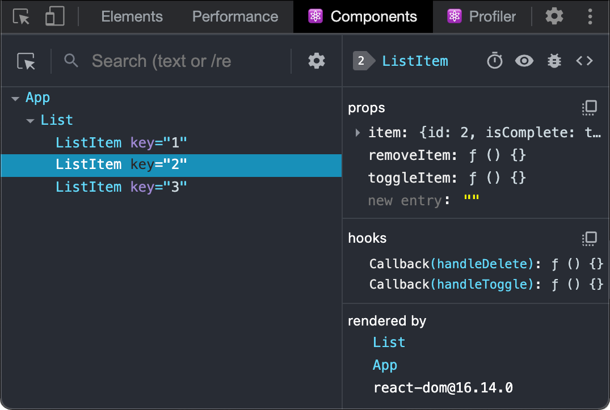
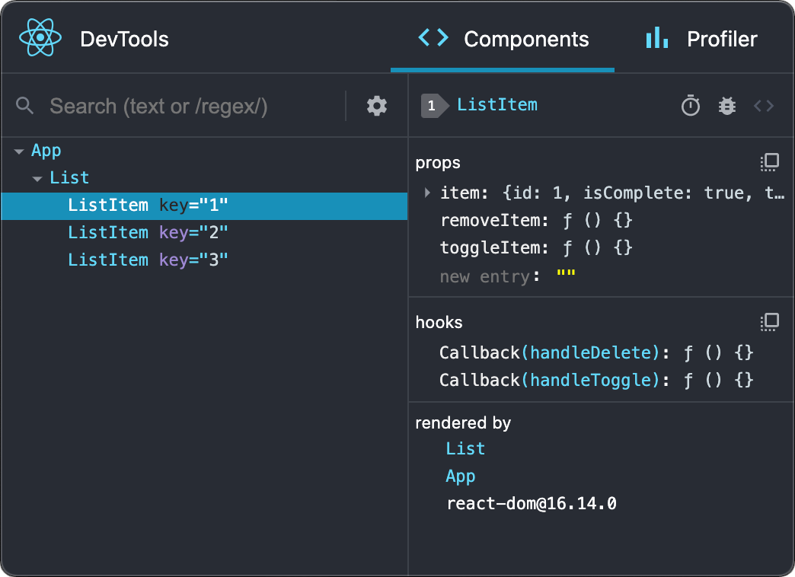

# React Developer Tools

Используйте React Developer Tools для проверки React [components](your-first-component.md), редактирования [props](passing-props-to-a-component.md) и [state](state-a-components-memory.md) и выявления проблем производительности.

!!!tip "Вы узнаете"

    -   Как установить React Developer Tools

## Расширение для браузера

Самый простой способ отладки веб-сайтов, созданных с помощью React, - установить расширение для браузера React Developer Tools. Оно доступно для нескольких популярных браузеров:

-   [Установить для **Chrome**](https://chrome.google.com/webstore/detail/react-developer-tools/fmkadmapgofadopljbjfkapdkoienihi?hl=en)
-   [Установить для **Firefox**](https://addons.mozilla.org/ru/firefox/addon/react-devtools/)
-   [Установить для **Edge**](https://microsoftedge.microsoft.com/addons/detail/react-developer-tools/gpphkfbcpidddadnkolkpfckpihlkkil)

Теперь, если вы посетите сайт, **построенный с помощью React,** вы увидите панели _Components_ и _Profiler_.



### Safari и другие браузеры

Для других браузеров (например, Safari) установите пакет npm [`react-devtools`](https://www.npmjs.com/package/react-devtools):

```bash
# Yarn
yarn global add react-devtools

# Npm
npm install -g react-devtools
```

Затем откройте инструменты разработчика из терминала:

```bash
react-devtools
```

Затем подключите свой сайт, добавив следующий тег `<script>` в начало `<head>` вашего сайта:

```html
<html>
    <head>
        <script src="http://localhost:8097"></script>
    </head>
</html>
```

Перезагрузите свой сайт в браузере, чтобы просмотреть его в инструментах разработчика.



## Мобильные устройства (React Native)

React Developer Tools можно использовать и для проверки приложений, созданных с помощью [React Native](https://reactnative.dev/).

Самый простой способ использовать React Developer Tools - установить его глобально:

```bash
# Yarn
yarn global add react-devtools

# Npm
npm install -g react-devtools
```

Затем откройте инструменты разработчика из терминала.

```bash
react-devtools
```

Он должен подключиться к любому локальному запущенному приложению React Native.

!!!note ""

    Попробуйте перезагрузить приложение, если инструменты разработчика не подключаются через несколько секунд.

## Ссылки

-   [Подробнее об отладке React Native.](https://reactnative.dev/docs/debugging)
-   [https://react.dev/learn/react-developer-tools](https://react.dev/learn/react-developer-tools)
