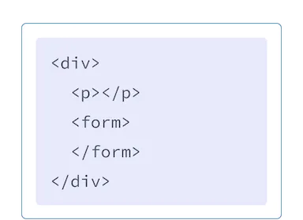
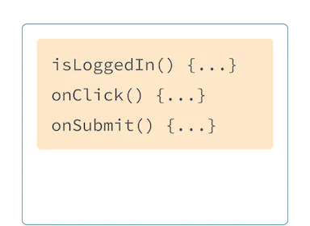

# Пишем разметку с JSX

<big>**JSX** - это расширение синтаксиса для JavaScript, позволяющее писать HTML-подобную разметку внутри файла JavaScript. Хотя существуют и другие способы написания компонентов, большинство разработчиков React предпочитают лаконичность JSX, и большинство кодовых баз используют именно его.</big>

!!!tip "Вы узнаете"

    -   Почему React смешивает разметку с логикой рендеринга
    -   Чем JSX отличается от HTML
    -   Как отображать информацию с помощью JSX

## JSX: размещение разметки в JavaScript {#jsx-putting-markup-into-javascript}

Веб был построен на HTML, CSS и JavaScript. В течение многих лет веб-разработчики хранили содержимое в HTML, дизайн в CSS, а логику в JavaScript - часто в отдельных файлах! Контент размечался внутри HTML, а логика страницы жила отдельно в JavaScript:

<figure markdown>

<figurecaption>HTML</figurecaption>
</figure>

<figure markdown>

<figurecaption>JavaScript</figurecaption>
</figure>

Но по мере того, как веб становился все более интерактивным, логика все больше определяла содержание. JavaScript стал отвечать за HTML! Вот почему **в React логика рендеринга и разметка живут вместе в одном месте - в компонентах.**.

<figure markdown>

<figurecaption markdown>`Sidebar.js` React компонент</figurecaption>
</figure>

<figure markdown>

<figurecaption markdown>`Form.js` React компонент</figurecaption>
</figure>

Совместное использование логики рендеринга и разметки кнопки гарантирует, что они будут синхронизироваться друг с другом при каждом редактировании. И наоборот, детали, не связанные между собой, такие как разметка кнопки и разметка боковой панели, изолированы друг от друга, что делает более безопасным изменение любой из них по отдельности.

Каждый компонент React - это функция JavaScript, которая может содержать некоторую разметку, которую React отображает в браузере. Компоненты React используют расширение синтаксиса под названием JSX для представления этой разметки. JSX очень похож на HTML, но он немного строже и может отображать динамическую информацию. Лучший способ понять это - преобразовать некоторую HTML-разметку в JSX-разметку.

!!!note "JSX и React"

    JSX и React - это две разные вещи. Их часто используют вместе, но вы _можете_ использовать их независимо.

## Преобразование HTML в JSX {#converting-html-to-jsx}

Предположим, что у вас есть некоторый (совершенно правильный) HTML:

```html
<h1>Hedy Lamarr's Todos</h1>

<ul>
    <li>Invent new traffic lights</li>
    <li>Rehearse a movie scene</li>
    <li>Improve the spectrum technology</li>
</ul>
```

И вы хотите поместить его в свой компонент:

```js
export default function TodoList() {
  return (
    // ???
  )
}
```

Если вы скопируете и вставите его как есть, он не будет работать:

=== "App.js"

    ```js hl_lines="5"
    export default function TodoList() {
    return (
    	// This doesn't quite work!
    	<h1>Hedy Lamarr's Todos</h1>
    	
    	<ul>
    	  <li>Invent new traffic lights
    	  <li>Rehearse a movie scene
    	  <li>Improve the spectrum technology
    	</ul>
    );
    }
    ```

=== "Результат"

    <iframe src="https://codesandbox.io/embed/9m6zmf?view=Editor+%2B+Preview" style="width:100%; height: 500px; border:0; border-radius: 4px; overflow:hidden;" title="react.dev" allow="accelerometer; ambient-light-sensor; camera; encrypted-media; geolocation; gyroscope; hid; microphone; midi; payment; usb; vr; xr-spatial-tracking" sandbox="allow-forms allow-modals allow-popups allow-presentation allow-same-origin allow-scripts"></iframe>

Это связано с тем, что JSX более строгий и имеет несколько больше правил, чем HTML! Если вы прочитаете приведенные выше сообщения об ошибках, они подскажут вам, как исправить разметку, или вы можете следовать руководству, приведенному ниже.

!!!note "Сообщения об ошибках React"

    В большинстве случаев экранные сообщения об ошибках React помогут вам найти причину проблемы. Прочитайте их, если вы застряли!

## Правила JSX {#the-rules-of-jsx}

### 1. Возвращает один корневой элемент {#1-return-a-single-root-element}

Чтобы вернуть несколько элементов из компонента, **оберните их одним родительским тегом**.

Например, вы можете использовать [`<div>`](https://hcdev.ru/html/div/):

```js hl_lines="1 11"
<div>
  <h1>Hedy Lamarr's Todos</h1>
  
  <ul>
    ...
  </ul>
</div>
```

Если вы не хотите добавлять в разметку лишние `<div>`, вместо них можно написать `<>` и <code>&lt;/&gt;</code>:

```js hl_lines="1 11"
<>
  <h1>Hedy Lamarr's Todos</h1>
  
  <ul>
    ...
  </ul>
</>
```

Этот пустой тег называется _[Фрагмент](../reference/Fragment.md)_. Фрагменты позволяют группировать элементы, не оставляя никаких следов в HTML-дереве браузера.

!!!note "Почему несколько тегов JSX должны быть обернуты?"

    JSX выглядит как HTML, но под капотом он преобразуется в обычные объекты JavaScript. Вы не можете вернуть два объекта из функции, не обернув их в массив. Это объясняет, почему вы также не можете вернуть два тега JSX, не обернув их в другой тег или фрагмент.

### 2. Закройте все теги {#2-close-all-the-tags}

JSX требует, чтобы теги были явно закрыты: самозакрывающиеся теги, такие как [``](https://hcdev.ru/html/img/) должны стать ``, а оберточные теги типа `<li>oranges` должны быть записаны как `<li>oranges</li>`.

Так выглядит закрытый образ Хеди Ламарр и элементы списка:

```js hl_lines="2-6 8-10"
<>
    
    <ul>
        <li>Invent new traffic lights</li>
        <li>Rehearse a movie scene</li>
        <li>Improve the spectrum technology</li>
    </ul>
</>
```

### 3. В camelCase <s>все</s> большинство вещей! {#3-camelcase-salls-most-of-the-things}

JSX превращается в JavaScript, а атрибуты, записанные в JSX, становятся ключами объектов JavaScript. В ваших собственных компонентах вы часто захотите считать эти атрибуты в переменные. Но JavaScript имеет ограничения на имена переменных. Например, их имена не могут содержать тире или быть зарезервированными словами, такими как `class`.

Вот почему в React многие атрибуты HTML и SVG записываются в camelCase. Например, вместо `stroke-width` вы используете `strokeWidth`. Поскольку `class` является зарезервированным словом, в React вместо него пишется `className`, названный в честь [соответствующего свойства DOM](https://developer.mozilla.org/docs/Web/API/Element/className):

```js hl_lines="4"

```

Вы можете найти все эти атрибуты в списке атрибутов компонентов DOM. Если вы ошибетесь, не волнуйтесь - React выведет сообщение с возможным исправлением в [консоль браузера](https://developer.mozilla.org/docs/Tools/Browser_Console).

!!!warning "Внимание"

    По историческим причинам атрибуты [`aria-*`](https://developer.mozilla.org/docs/Web/Accessibility/ARIA) и [`data-*`](https://developer.mozilla.org/docs/Learn/HTML/Howto/Use_data_attributes) записываются как в HTML с тире.

### Совет: Используйте JSX-конвертер {#pro-tip-use-a-jsx-converter}

Преобразование всех этих атрибутов в существующей разметке может быть утомительным! Мы рекомендуем использовать [конвертер](https://transform.tools/html-to-jsx) для перевода существующих HTML и SVG в JSX. Конвертеры очень полезны на практике, но все же стоит понимать, что происходит, чтобы вам было удобно писать JSX самостоятельно.

Вот ваш конечный результат:

=== "App.js"

    ```js
    export default function TodoList() {
    	return (
    		<>
    			<h1>Hedy Lamarr's Todos</h1>
    			
    			<ul>
    				<li>Invent new traffic lights</li>
    				<li>Rehearse a movie scene</li>
    				<li>Improve the spectrum technology</li>
    			</ul>
    		</>
    	);
    }
    ```

=== "Результат"

    <iframe src="https://codesandbox.io/embed/j9tr6f?view=Editor+%2B+Preview" style="width:100%; height: 500px; border:0; border-radius: 4px; overflow:hidden;" title="react.dev" allow="accelerometer; ambient-light-sensor; camera; encrypted-media; geolocation; gyroscope; hid; microphone; midi; payment; usb; vr; xr-spatial-tracking" sandbox="allow-forms allow-modals allow-popups allow-presentation allow-same-origin allow-scripts"></iframe>

!!!note "Итоги"

    Теперь вы знаете, зачем существует JSX и как использовать его в компонентах:

    -   Компоненты React группируют логику рендеринга вместе с разметкой, потому что они связаны.
    -   JSX похож на HTML, с некоторыми отличиями. При необходимости вы можете использовать [конвертер](https://transform.tools/html-to-jsx).
    -   Сообщения об ошибках часто указывают вам правильное направление для исправления разметки.

## Задача {#challenges}

### 1. Преобразование HTML в JSX {#convert-some-html-to-jsx}

Этот HTML был вставлен в компонент, но это не валидный JSX. Исправьте это:

=== "App.js"

    ```
    export default function Bio() {
    	return (
    		<div class="intro">
    			<h1>Welcome to my website!</h1>
    		</div>
    		<p class="summary">
    			You can find my thoughts here.
    			<br><br>
    			<b>And <i>pictures</b></i> of scientists!
    		</p>
    	);
    }
    ```

=== "Результат"

    <iframe src="https://codesandbox.io/embed/22mwtq?view=Editor+%2B+Preview" style="width:100%; height: 500px; border:0; border-radius: 4px; overflow:hidden;" title="react.dev" allow="accelerometer; ambient-light-sensor; camera; encrypted-media; geolocation; gyroscope; hid; microphone; midi; payment; usb; vr; xr-spatial-tracking" sandbox="allow-forms allow-modals allow-popups allow-presentation allow-same-origin allow-scripts"></iframe>

Делать ли это вручную или с помощью конвертера - решать вам!

???success "Показать решение"

    === "App.js"

    	```js
    	export default function Bio() {
    		return (
    			<div>
    				<div className="intro">
    					<h1>Welcome to my website!</h1>
    				</div>
    				<p className="summary">
    					You can find my thoughts here.
    					<br />
    					<br />
    					<b>
    						And <i>pictures</i>
    					</b> of scientists!
    				</p>
    			</div>
    		);
    	}
    	```

    === "Результат"

    	<iframe src="https://codesandbox.io/embed/ncrnvy?view=Editor+%2B+Preview" style="width:100%; height: 500px; border:0; border-radius: 4px; overflow:hidden;" title="react.dev" allow="accelerometer; ambient-light-sensor; camera; encrypted-media; geolocation; gyroscope; hid; microphone; midi; payment; usb; vr; xr-spatial-tracking" sandbox="allow-forms allow-modals allow-popups allow-presentation allow-same-origin allow-scripts"></iframe>

<small>:material-information-outline: Источник &mdash; [https://react.dev/learn/writing-markup-with-jsx](https://react.dev/learn/writing-markup-with-jsx)</small>
