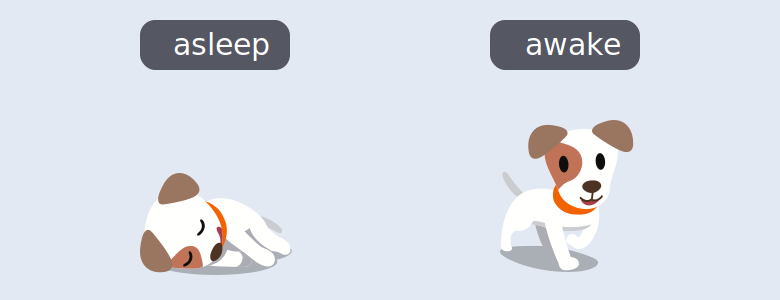
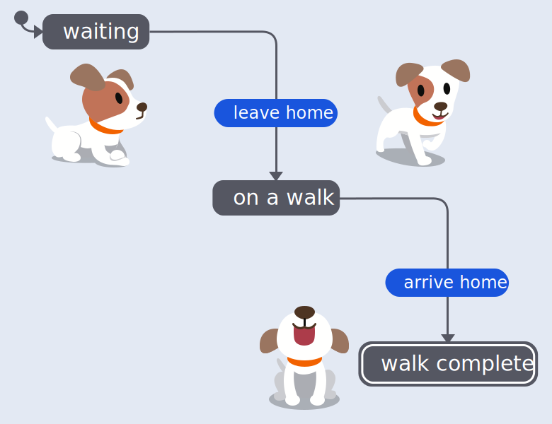
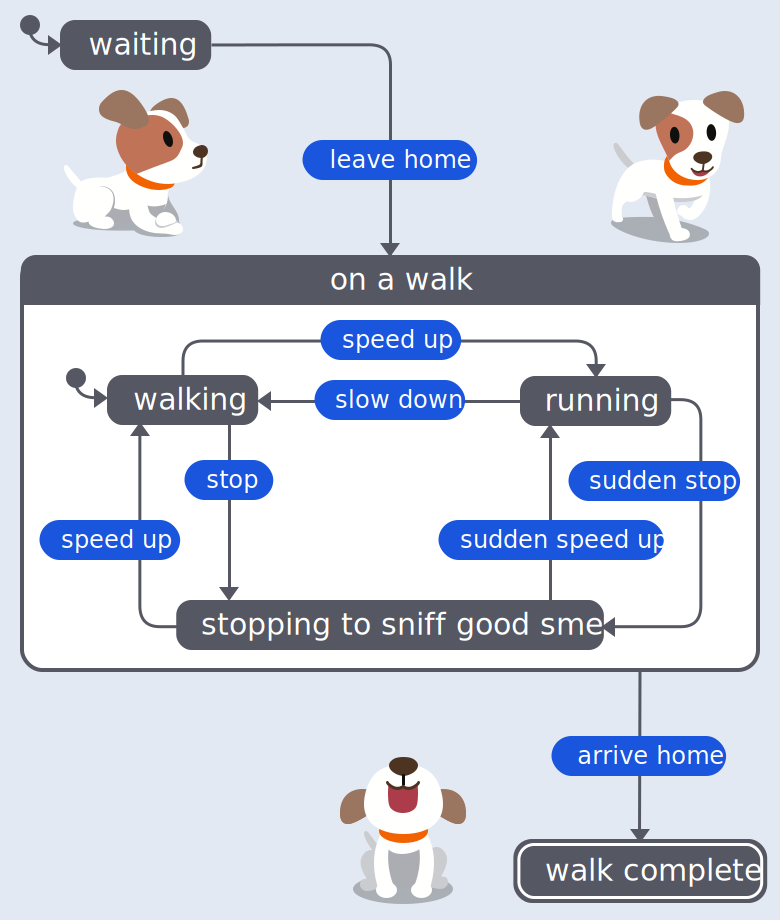
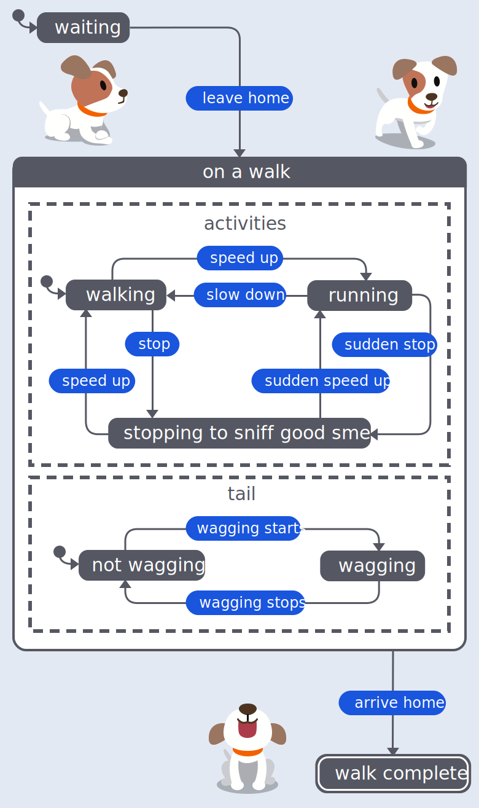
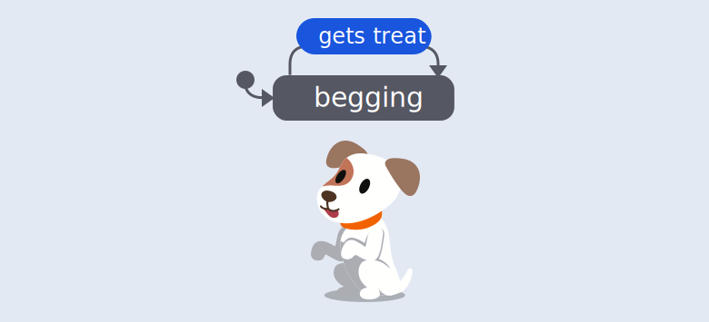
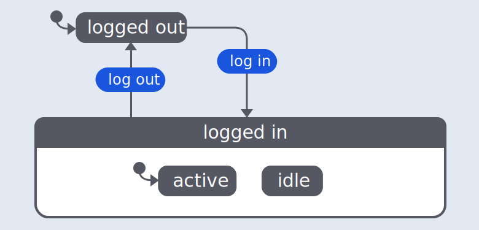
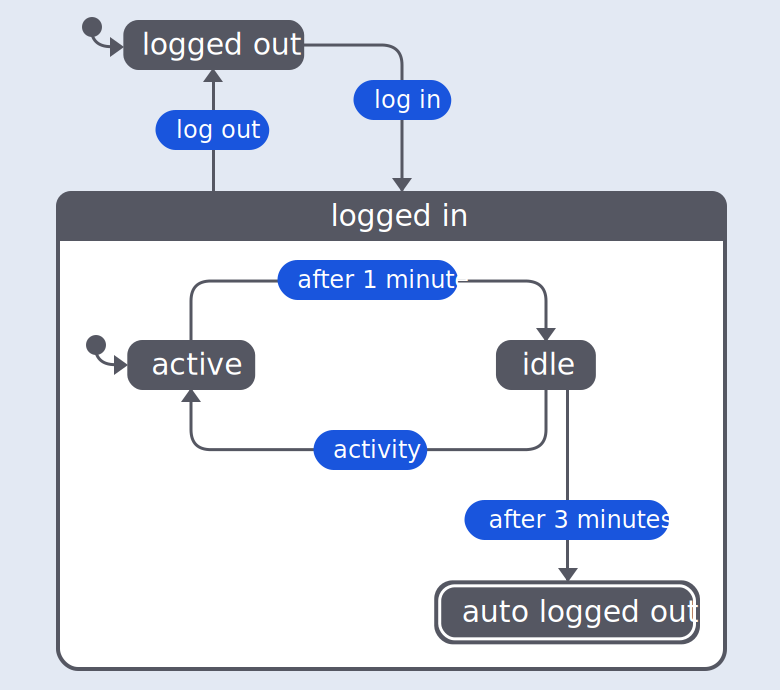
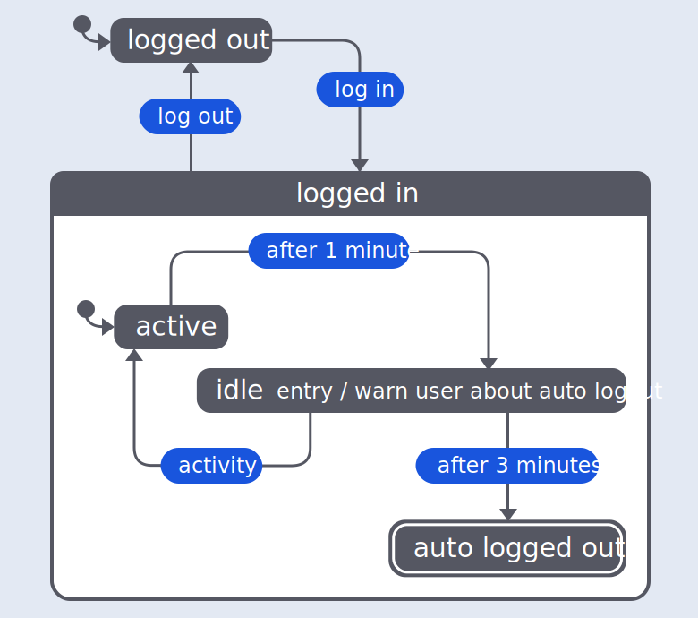

# Введение в конечные автоматы и диаграммы состояний

_Диаграммы состояний_ (Statecharts) - это визуальный язык, используемый для описания состояний процесса.

Возможно, вы использовали подобные схемы в прошлом для разработки пользовательских потоков, планирования баз данных или сопоставления архитектуры приложений. Диаграммы состояний - это еще один способ использования прямоугольников и стрелок для представления потоков, но с XState эти потоки также являются исполняемым кодом, который можно использовать для управления логикой в ​​ваших приложениях.

## Состояния

_Состояния_ (states) представлены прямоугольниками со скругленными углами. Чтобы нарисовать диаграмму состояний собаки, сначала на ум приходят два состояния:

Собака всегда **спит** или **бодрствует**. Собака не может спать и бодрствовать одновременно, и собака не может ни спать, ни бодрствовать. Есть только эти два состояния, строго ограниченное, _конечное_ число состояний.

## Переходы и события

То, как собака переходит между **сном** и **бодрствованием**, происходит через _переходы_ (transitions), которые символизируются стрелкой, указывающей от одного состояния к другому в последовательности процесса.

Переход вызван _событием_ (event), которое приводит к изменению состояния. Переходы помечены своими событиями.

Переходы и события _детерминированы_. Детерминированный означает, что каждый переход и событие всегда указывают на одно и то же следующее состояние и всегда приводят к одному и тому же результату из заданного начального состояния при каждом запуске процесса. Собаки никогда не _просыпаются_, чтобы _заснуть_, и никогда не _засыпают_, чтобы _проснуться_.

Этот крошечный собачий процесс с двумя конечными состояниями и двумя переходами является _конечным автоматом_ (state machine). Конечный автомат используется для описания поведения чего-либо. Автомат описывает состояния объекта и переходы между этими состояниями. Это конечный автомат, потому что он имеет конечное число состояний. (Иногда люди сокращенно называют конечные автоматы FSM).

## Начальное состояние

Любой процесс, у которого есть состояния, будет иметь _начальное состояние_ (initial state), состояние по умолчанию, в котором процесс существует до тех пор, пока не произойдет событие, изменяющее состояние процесса.

Начальное состояние представлено закрашенным кружком со стрелкой, указывающей от круга к начальному состоянию.

Используя диаграмму состояний для описания процесса выгула собаки, начальным состоянием будет **ожидание** прогулки.

## Конечное состояние

Большинство процессов с состояниями будут иметь _конечное состояние_ (final state), последнее состояние, когда процесс завершен. Конечное состояние представлено двойной рамкой на прямоугольнике с закругленными углами.

В диаграмме состояний выгула собаки конечным состоянием будет **прогулка завершена**.

## Составные состояния

Составное состояние - это состояние, которое может содержать больше состояний, также называемых дочерними состояниями. Эти дочерние состояния могут возникать только тогда, когда происходит родительское составное состояние. Внутри состояния «**на прогулке**» могут быть дочерние состояния **ходьбы**, **бега** и **остановки**, чтобы почувствовать запахи.

Составное состояние символизируется помеченным прямоугольником со скругленными углами, который действует как контейнер для своих дочерних состояний.

Составное состояние также должно указывать, какое дочернее состояние является начальным. В составном состоянии **на прогулке** начальное состояние - это **ходьба**.

Составные состояния - это то, что делает диаграммы состояний способными обрабатывать более сложные задачи, чем обычный конечный автомат.

### Атомарные состояния

Атомарное состояние - это состояние, не имеющее дочерних состояний. **Ожидание**, **завершенная прогулка**, **ходьба**, **бег** и **остановка**, чтобы вдохнуть приятный запах, - все это атомарные состояния.

### Параллельные состояния

Параллельное состояние - это составное состояние, в котором все его дочерние состояния, также известные как _регионы_, активны одновременно. Внутри контейнера составного состояния области разделены пунктирной линией.

Внутри составного состояния **на прогулке** может быть две области (региона). Одна область содержит дочерние состояния активности собаки: **ходьбу**, **бег** и **остановку**, чтобы вдохнуть приятный запах, а другая область содержит состояния хвоста собаки, когда она **виляет**, и **не виляет**. Собака может ходить и вилять хвостом, бегать и вилять хвостом или останавливаться и принюхиваться, виляя хвостом, она также может выполнять любое из этих действий, не виляя хвостом.

Каждая область также должна указывать, какое дочернее состояние является начальным. В нашей хвостовой области исходное состояние **не виляет**.

### Переход без смены состояния

Переход без смены состояния (self-transition) - это когда событие происходит, но переход возвращается в то же состояние. Стрелка перехода выходит и снова входит в то же состояние.

Полезный способ описать самопереход - это «что-то делать, а не куда-то идти» в процессе.

В процессе попрошайничества собаки, будет состояние **попрошайничества** с событием **получения угощения**. А для собак, которые любят свою еду, независимо от того, сколько раз вы проходите через событие **получения угощения**, собака возвращается в свое состояние **попрошайничества**.

## Планирование диаграмм состояний

Одно из преимуществ диаграмм состояний заключается в том, что в процессе составления диаграммы состояний вы исследуете все возможные состояния в своем процессе. Это исследование поможет вам избежать ошибок и ошибок в коде, так как вы с большей вероятностью охватите все возможные ситуации.

А поскольку диаграммы состояний являются исполняемыми, они могут вести себя и как диаграмма, и как код, что снижает вероятность того, что вы внесете различия или ошибки при интерпретации между средами построения диаграмм и кодирования.

### Планирование диаграммы состояний для автомата входа в систему

Чтобы нарисовать диаграмму состояний для машины входа в систему, начните с перечисления основных _событий_ в процессе. Подумайте, что будет _делать_ ваш процесс входа в систему:

- `log in`
- `log out`

Затем перечислите _состояния_, которые существуют в результате этих событий:

- `logged in`
- `logged out`

Когда есть какие-то события и состояния, начинает складываться диаграмма состояний.

Не забывайте _исходное состояние_. В этом случае состояние **выхода из системы** является начальным состоянием, так как любой новый пользователь войдет в процесс, выйдя из системы.

## Отложенные переходы

Некоторые процессы входа и выхода из системы будут отключать неактивного пользователя через фиксированный промежуток времени в качестве меры безопасности.

**Активное** и **незанятое** состояния возникают только тогда, когда пользователь вошел в систему, поэтому они становятся дочерними состояниями внутри составного состояния **вошедшего в систему**.

Начальное состояние внутри составного состояния «**вошел в систему**» ​​является _активным_, поскольку это происходит как прямой результат события **входа в систему**, а вход в систему является признаком активности пользователя.

_Отложенный переход_ (delayed transition) - это тип перехода, который происходит после нахождения в состоянии в течение определенного периода времени. Отложенный переход помечен «после» и фиксированной продолжительностью, чтобы указать, сколько времени должно пройти до перехода в следующее указанное состояние.

В диаграмме состояний входа в систему за **активным** состоянием следует отложенный переход на **60000** миллисекунд или 1 минуту, чтобы определить, находится ли пользователь в **режиме ожидания**. Если событие **активности** происходит до того, как переход достигает одной минуты, процесс возвращается в активное состояние.

Отложенный переход на **180000** миллисекунд, или 3 минуты, следует за состоянием **ожидания** для перехода в состояние **автоматического выхода** из системы, если пользователь остается в режиме ожидания.

## Действия

Диаграмма состояний используется для обозначения _действий_ (actions) в системе за пределами диаграммы состояний. Действия также широко известны как _эффекты_ (effects) или _побочные эффекты_ (side-effects). «Побочные эффекты» звучат как отрицательный или неважный термин, но инициирование действий - основная цель использования диаграмм состояний.

Действия - это события, которые не имеют влияния или последствий для остальной части последовательности, событие просто запускается, и последовательность переходит к следующему этапу процесса. Например, диаграмма состояний входа в систему может выполнять действия, которые изменяют пользовательский интерфейс.

_Действие_ может запускаться при входе в состояние или выходе из него, а также при переходе. Действие над состоянием включается в контейнер состояния с меткой «вход /» или «выход /» в зависимости от того, должно ли действие запускаться при входе в состояние или выходе из него.

В диаграмме состояний входа в систему есть действие входа в состояние **ожидания**, чтобы предупредить пользователя о том, что он может выйти из системы.

